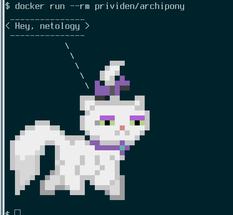
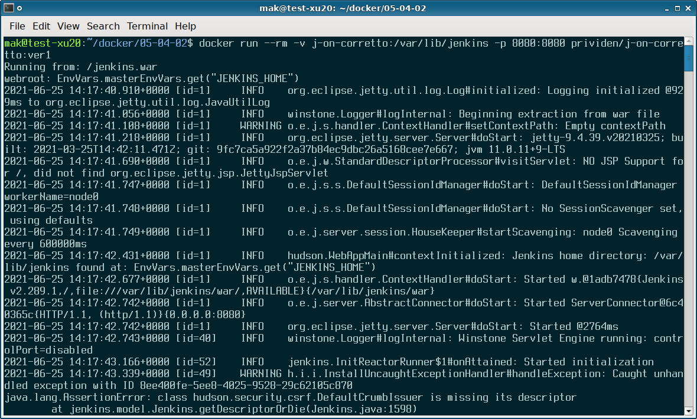
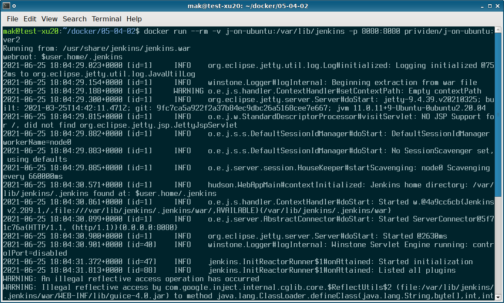
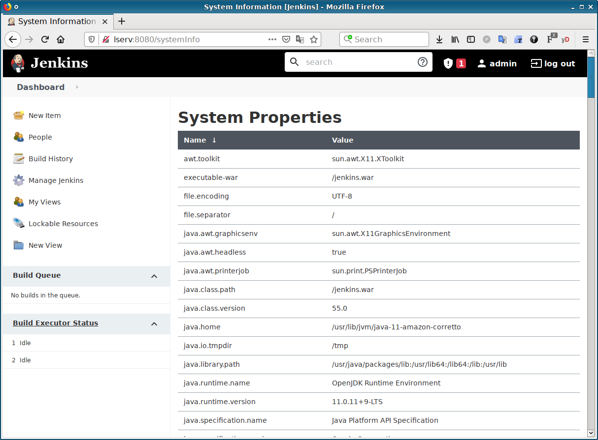
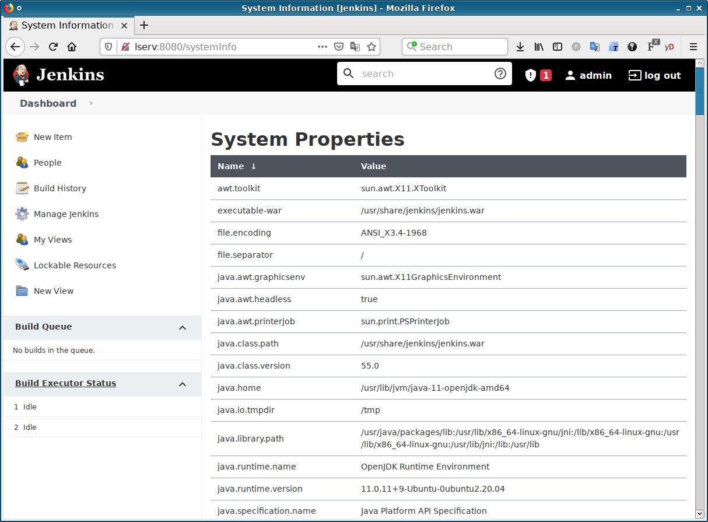
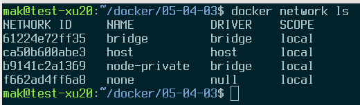
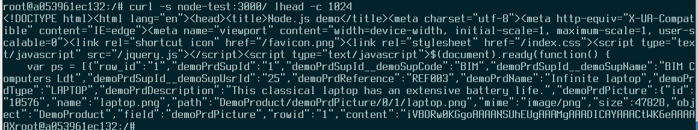

# Домашняя работа по занятию "5.4. Практические навыки работы с Docker"


> 1. Измените базовый образ предложенного Dockerfile на Arch Linux c сохранением его функциональности.

"функциональности" - не собираться и глючить? ;)

> Для получения зачета, вам необходимо предоставить:
> - Написанный вами Dockerfile
```
FROM archlinux

RUN pacman -Sy --noconfirm ponysay && yes |pacman -Scc

ENTRYPOINT ["/usr/bin/ponysay"]
CMD ["Hey, netology"]
```  

> - Скриншот вывода командной строки после запуска контейнера из вашего базового образа

  
Как-то эта кошка унылая не похожа на пони.... но я не виноват!!

> - Ссылку на образ в вашем хранилище docker-hub

https://hub.docker.com/r/prividen/archipony

---
> 2. В данной задаче вы составите несколько разных Dockerfile для проекта Jenkins, опубликуем образ в `dockerhub.io` и посмотрим логи этих контейнеров.  
> ...

> Для получения зачета, вам необходимо предоставить:
> - Наполнения 2х Dockerfile из задания

"Наполнения" - в смысле, содержимое?
- [amazoncorretto](j-on-corretto.Dockerfile):
```
FROM amazoncorretto:11
ARG J_LINK=https://get.jenkins.io/war-stable/2.289.1/jenkins.war
RUN curl -s $(curl -sI $J_LINK |grep -m 1 link: |cut -f2 -d'<' |cut -f1 -d'>') > /jenkins.war && \
	mkdir /var/lib/jenkins
ENV JENKINS_HOME=/var/lib/jenkins
EXPOSE 8080
ENTRYPOINT ["/usr/bin/java"]
CMD ["-jar", "/jenkins.war"]
```

- [ubuntu](j-on-ubuntu.Dockerfile):
```
FROM ubuntu:latest

RUN apt-get update && apt-get -y install gnupg wget && apt-get -y install ca-certificates && \
	wget -q -O - https://pkg.jenkins.io/debian-stable/jenkins.io.key | apt-key add - && \
	echo "deb https://pkg.jenkins.io/debian-stable binary/" >> /etc/apt/sources.list && \
	apt-get update && apt-get -y install openjdk-11-jre jenkins && \
	apt-get clean

EXPOSE 8080

USER jenkins
ENTRYPOINT ["java"]
CMD ["-Djava.awt.headless=true", "-jar", "/usr/share/jenkins/jenkins.war"]
```


> - Скриншоты логов запущенных вами контейнеров (из командной строки)

- amazoncorretto:  


- ubuntu:  

  
> - Скриншоты веб-интерфейса Jenkins запущенных вами контейнеров (достаточно 1 скриншота на контейнер)
  
- amazoncorretto:  


- ubuntu:  


> - Ссылки на образы в вашем хранилище docker-hub

- https://hub.docker.com/r/prividen/j-on-corretto
- https://hub.docker.com/r/prividen/j-on-ubuntu

---
> Задача 3 
> - Соберите образ и запустите контейнер в фоновом режиме с публикацией порта
> - Запустить второй контейнер из образа ubuntu:latest 
> - Создайть `docker network` и добавьте в нее оба запущенных контейнера
> - Используя `docker exec` запустить командную строку контейнера `ubuntu` в интерактивном режиме
> - Используя утилиту `curl` вызвать путь `/` контейнера с npm приложением

```
mak@test-xu20:~/docker/05-04-03$ docker run --rm -p 3000 -d --name node-test prividen/node-demo
c004bc3a98b4c155cac9cce029ad3c2867aca2ddb7a637c6dc9664b5b0592685

mak@test-xu20:~/docker/05-04-03$ docker run -dit --name ubuntu-test ubuntu:latest 
a053961ec1328379f40c279c3a98ccf9fba709f665e716633574804ff6e4001f

mak@test-xu20:~/docker/05-04-03$ docker network create node-private
b9141c2a13691692736048c07075f3893ea01ff701dbd5baaf500a8187cb4fac

mak@test-xu20:~/docker/05-04-03$ docker network connect node-private node-test
mak@test-xu20:~/docker/05-04-03$ docker network connect node-private ubuntu-test

mak@test-xu20:~/docker/05-04-03$ docker exec -it ubuntu-test bash
root@a053961ec132:/# apt-get update &>/dev/null && apt-get install -y curl &>/dev/null
root@a053961ec132:/# curl -s node-test:3000/ |head -c 1024
<!DOCTYPE html><html lang="en"><head><title>Node.js demo</title><meta charset="utf-8"><meta http-equiv="X-UA-Compatible" content="IE=edge"><meta name="viewport" content="width=device-width, initial-scale=1, maximum-scale=1, user-scalable=0"><link rel="shortcut icon" href="/favicon.png"><link rel="stylesheet" href="/index.css"><script type="text/javascript" src="/jquery.js"></script><script type="text/javascript">$(document).ready(function() {
    var ps = [{"row_id":"1","demoPrdSupId":"1","demoPrdSupId__demoSupCode":"BIM","demoPrdSupId__demoSupName":"BIM Computers Ldt","demoPrdSupId__demoSupUsrId":"25","demoPrdReference":"REF003","demoPrdName":"Infinite laptop","demoPrdType":"LAPTOP","demoPrdDescription":"This classical laptop has an extensive battery life.","demoPrdPicture":{"id":"10576","name":"laptop.png","path":"DemoProduct/demoPrdPicture/0/1/laptop.png","mime":"image/png","size":47828,"object":"DemoProduct","field":"demoPrdPicture","rowid":"1","content":"iVBORw0KGgoAAAANSUhEUgAAAMgAAADICAYAAACtWK6eAAAAAX
root@a053961ec132:/# 
```
 
> Для получения зачета, вам необходимо предоставить:
> - Наполнение Dockerfile с npm приложением

```
FROM node

ADD https://github.com/simplicitesoftware/nodejs-demo/archive/refs/heads/master.zip /opt/

RUN cd /opt && unzip master.zip && rm -f master.zip && cd /opt/nodejs-demo-master/ && \
	npm install

WORKDIR /opt/nodejs-demo-master/

EXPOSE 3000

ENTRYPOINT ["npm"]
CMD ["start", "--host", "0.0.0.0", "--port", "3000"]
``` 
 
> - Скриншот вывода вызова команды списка docker сетей (docker network cli)

Доктор, откуда у вас такие команды...  

  
> - Скриншот вызова утилиты curl с успешным ответом



