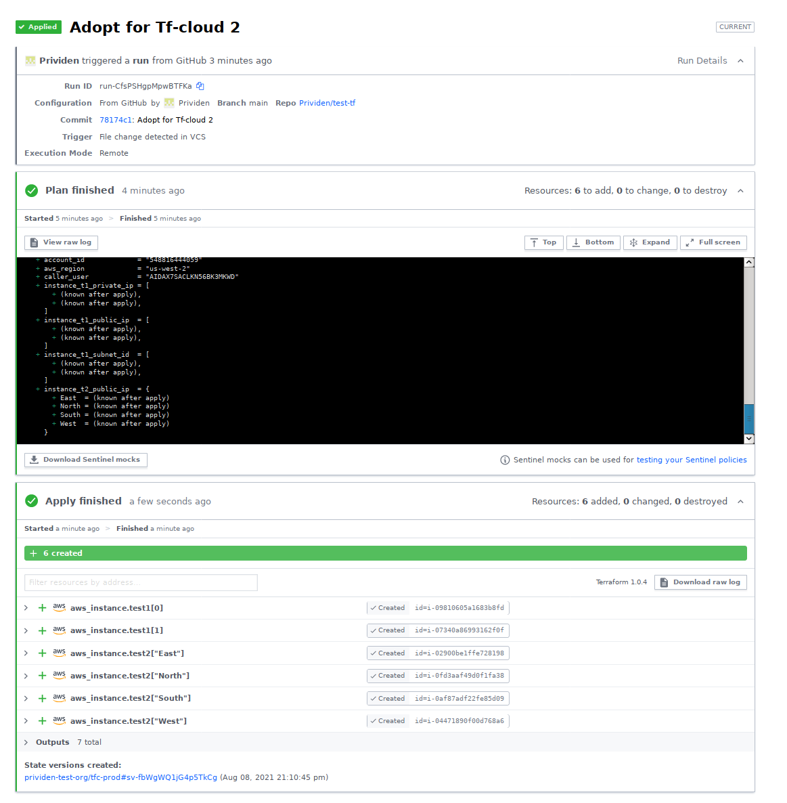
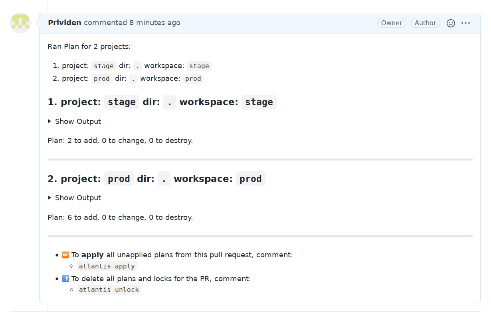
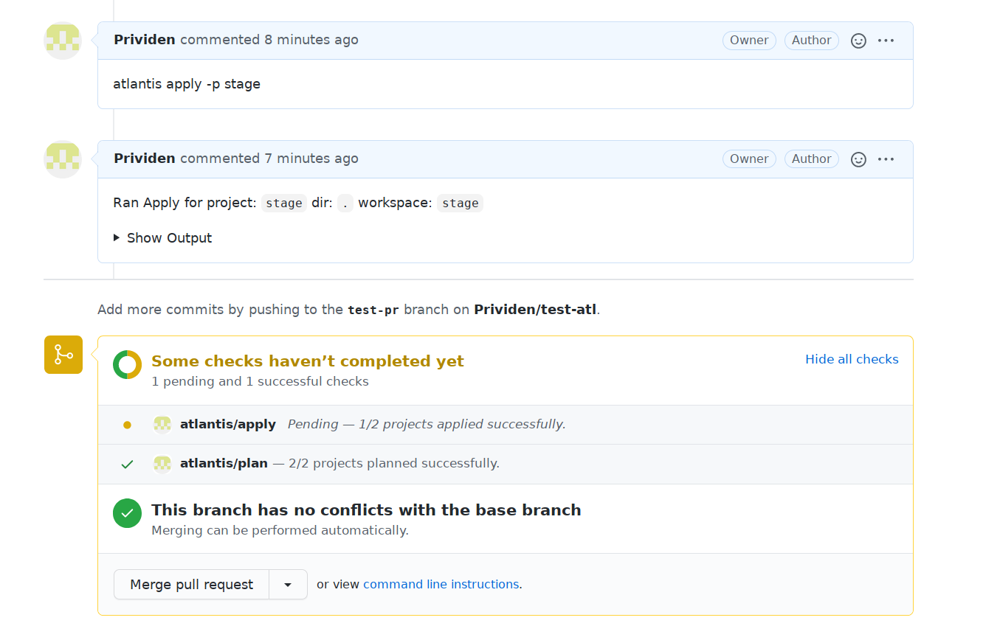

# Домашняя работа по занятию "7.4. Средства командной работы над инфраструктурой."

> Задача 1. Настроить terraform cloud (необязательно, но крайне желательно).  
В качестве результата задания приложите снимок экрана с успешным применением конфигурации.



---
> Задача 2. Написать серверный конфиг для атлантиса.  
В качестве результата приложите ссылку на файлы `server.yaml` и `atlantis.yaml`.

> Создай `server.yaml` который скажет атлантису:
> 1. Укажите, что атлантис должен работать только для репозиториев в вашем github (или любом другом) аккаунте.
> 1. На стороне клиентского конфига разрешите изменять `workflow`, то есть для каждого репозитория можно 
будет указать свои дополнительные команды. 
> 1. В `workflow` используемом по-умолчанию сделайте так, что бы во время планирования не происходил `lock` состояния.

==> [server.yaml](server.yaml)

> Создай `atlantis.yaml` который, если поместить в корень terraform проекта, скажет атлантису:
> 1. Надо запускать планирование и аплай для двух воркспейсов `stage` и `prod`.
> 1. Необходимо включить автопланирование при изменении любых файлов `*.tf`.

==> [atlantis.yaml](https://github.com/Prividen/test-atl/blob/main/atlantis.yaml)




---
> Задача 3. Знакомство с каталогом модулей. 
> 1. В [каталоге модулей](https://registry.terraform.io/browse/modules) найдите официальный модуль от aws для создания
`ec2` инстансов. 
> 2. Изучите как устроен модуль. Задумайтесь, будете ли в своем проекте использовать этот модуль или непосредственно 
ресурс `aws_instance` без помощи модуля?

Вряд ли он как-то сильно облегчил жизнь, все параметры скопипастились почти "как есть" из блока инстанса в блок модуля. 
А вот мутных проблемок добавил - не заработал, пока я ему subnet_id не подсунул (хотя, параметр вроде не обязательный).

> 3. В рамках предпоследнего задания был создан ec2 при помощи ресурса `aws_instance`. 
Создайте аналогичный инстанс при помощи найденного модуля.
   
```
$ terraform apply -auto-approve
...
module.ec2-instance.aws_instance.this[0]: Creating...
module.ec2-instance.aws_instance.this[0]: Still creating... [10s elapsed]
module.ec2-instance.aws_instance.this[0]: Still creating... [20s elapsed]
module.ec2-instance.aws_instance.this[0]: Creation complete after 20s [id=i-0a42a7b3998b24d90]

Apply complete! Resources: 1 added, 0 changed, 0 destroyed.

Outputs:

account_id = "548816444059"
aws_region = "us-west-2"
caller_user = "AIDAX7SACLKN56BK3MKWD"
instance_private_ip = [
  "172.31.51.191",
]
instance_public_ip = [
  "44.234.67.247",
]
instance_subnet_id = [
  "subnet-30af481a",
]
```

> В качестве результата задания приложите ссылку на созданный блок конфигураций.

https://github.com/Prividen/devops-netology/tree/0704-modules/terraform

